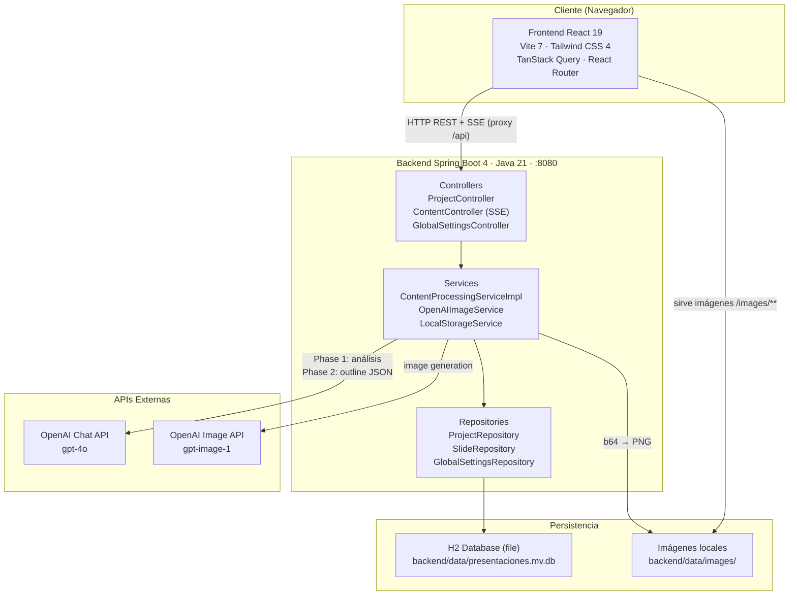
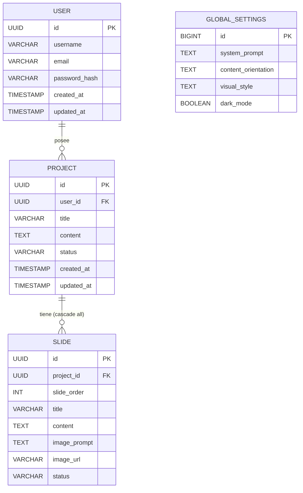

# AyG PresentacionesIA — Proyecto Final AI4Devs

> Generador automático de presentaciones profesionales a partir de transcripciones, potenciado por GPT-4o e IA de imágenes.

---

## Índice

1. [Ficha del proyecto](#1-ficha-del-proyecto)
2. [Descripción general del producto](#2-descripción-general-del-producto)
3. [Arquitectura del sistema](#3-arquitectura-del-sistema)
4. [Modelo de datos](#4-modelo-de-datos)
5. [Especificación de la API](#5-especificación-de-la-api)
6. [Historias de usuario](#6-historias-de-usuario)
7. [Tickets de trabajo](#7-tickets-de-trabajo)
8. [Pull Requests](#8-pull-requests)
9. [Suite de tests](#9-suite-de-tests)

---

## 1. Ficha del proyecto

| Campo | Valor |
|---|---|
| **Nombre** | AyG PresentacionesIA |
| **Descripción corta** | Genera presentaciones ejecutivas profesionales a partir de transcripciones de reuniones usando GPT-4o |
| **Repositorio de código** | https://github.com/allenajd3/AI4Devs-finalproject |
| **Estado** | MVP funcional — autenticación, tests y despliegue planificados para la Entrega 2 |
| **Autor** | AJD |
| **Fecha de inicio** | Abril 2026 |
| **Stack backend** | Java 21 · Spring Boot 4.0.2 · H2 Database · OpenAI API |
| **Stack frontend** | React 19 · TypeScript 5.9 · Vite 7 · Tailwind CSS 4 · TanStack Query 5 |
| **Dominio** | Productividad profesional / Automatización con IA |

---

## 2. Descripción general del producto

### 2.1 Objetivo

AyG PresentacionesIA resuelve un problema de productividad muy concreto y frecuente en entornos profesionales: convertir las notas o grabaciones de reuniones en presentaciones ejecutivas de calidad consume horas de trabajo manual. El sistema automatiza ese proceso de extremo a extremo: el usuario pega (o sube) la transcripción de la reunión y en minutos obtiene una presentación completa con slides estructuradas, contenido redactado e imágenes generadas por IA.

### 2.2 Problema que resuelve

- **Antes:** El profesional dedica entre 2 y 4 horas post-reunión estructurando notas, redactando contenido, buscando imágenes y maquetando slides en PowerPoint o Google Slides.
- **Después:** Con AyG PresentacionesIA, ese proceso se reduce a menos de 5 minutos: el usuario proporciona la transcripción y la IA genera automáticamente la estructura narrativa, el contenido por slide y las imágenes visuales.

### 2.3 Público objetivo

Profesionales y directivos que:
- Asisten frecuentemente a reuniones de trabajo o presentan resultados.
- Necesitan comunicar ideas complejas de forma visual y ejecutiva.
- No tienen tiempo (ni equipo de diseño) para producir presentaciones de calidad manualmente.

### 2.4 Características y funcionalidades principales

| # | Funcionalidad | Descripción | Estado |
|---|---|---|---|
| F-01 | Ingesta de transcripción | Texto pegado directamente o carga de archivo `.txt` | ✅ Implementada |
| F-02 | Análisis IA (Fase 1) | GPT-4o extrae estructura, puntos clave, métricas y temas visuales | ✅ Implementada |
| F-03 | Generación de outline (Fase 2) | GPT-4o crea 10-15 slides con título, contenido (ES) y description (EN) | ✅ Implementada |
| F-04 | Generación de imágenes | Una imagen por slide generada vía OpenAI Image API | ✅ Implementada |
| F-05 | Progreso en tiempo real | Server-Sent Events muestran cada paso de la generación al usuario | ✅ Implementada |
| F-06 | Gestión de proyectos | Crear, listar, ver detalle y eliminar presentaciones | ✅ Implementada |
| F-07 | Configuración global | System prompt, orientación de contenido, estilo visual, dark mode | ✅ Implementada |
| F-08 | Modo oscuro/claro | Toggle que persiste en base de datos y se aplica globalmente | ✅ Implementada |
| F-09 | Exportación a PDF | Descarga de la presentación completa | 📋 Pendiente — Entrega 2 |
| F-10 | Edición de slides | Modificar slides individuales tras la generación | 📋 Pendiente — Entrega 2 |

> 🔐 La autenticación multi-usuario (US-000 / TK-000) está diseñada en este PRD y planificada para la Entrega 2; el MVP actual opera en modo single-user local.

### 2.5 Diseño y experiencia de usuario

La interfaz usa un sidebar de navegación colapsable con tres secciones principales:

- **Crear** (`/crear`): formulario de ingesta de transcripción con validación (mínimo 100 caracteres), soporte para pegado y carga de archivo, y botón de generación.
- **Proyectos** (`/proyectos`): grid responsive de todas las presentaciones con estado visual (badge), miniatura de la primera imagen y acceso al detalle.
- **Ajustes** (`/ajustes`): textareas para personalizar el system prompt, la orientación del contenido y el estilo visual, más toggle de modo oscuro.

Durante la generación se muestra un modal de progreso en tiempo real con los pasos del pipeline IA.

---

## 3. Arquitectura del sistema

### 3.1 Diagrama de arquitectura



### 3.2 Descripción de componentes

**Frontend**

| Componente | Tecnología | Responsabilidad |
|---|---|---|
| Páginas (`/pages`) | React 19 + TSX | CrearPage, ProyectosPage, ProyectoDetallePage, AjustesPage |
| Layout | Tailwind CSS 4 | Sidebar colapsable, dark mode, navegación |
| Hooks (`/hooks`) | TanStack Query 5 | `useProjects`, `useSlides`, `useContentGeneration` (SSE) |
| Servicios (`/services`) | Axios 1.13 | `api.ts` (REST), `contentApi.ts` (SSE via EventSource) |
| Proxy Vite | Vite 7 | `/api` → `localhost:8080`, `/ws` → `localhost:8080` |

**Backend**

| Capa | Clases principales | Responsabilidad |
|---|---|---|
| Controller | `AuthController`, `ProjectController`, `ContentController`, `GlobalSettingsController` | Expone endpoints REST y SSE |
| Service | `AuthService`, `ContentProcessingServiceImpl`, `OpenAIImageService`, `LocalStorageService`, `GlobalSettingsService` | Lógica de negocio e integración OpenAI |
| Repository | `UserRepository`, `ProjectRepository`, `SlideRepository`, `GlobalSettingsRepository` | Acceso a datos vía Spring Data JPA |
| Model | `User`, `Project`, `Slide`, `GlobalSettings` | Entidades JPA |
| Config | `WebConfig` | Resource handlers para servir imágenes en `/images/**` |

**Integración OpenAI**

Las llamadas a OpenAI se realizan directamente mediante `RestTemplate` (HTTP puro, sin Spring AI), lo que proporciona control total sobre el request y facilita la portabilidad.

- **Chat:** `POST https://api.openai.com/v1/chat/completions` con modelo `gpt-4o`
- **Imágenes:** `POST https://api.openai.com/v1/images/generations` con modelo `gpt-image-1` (configurable)

### 3.3 Patrones de diseño utilizados

| Patrón | Aplicación |
|---|---|
| **Controller → Service → Repository** | Separación de responsabilidades en el backend |
| **DTO Pattern** | `ProjectCreateRequest`, `ProjectResponse`, `SlideResponse`, `GlobalSettingsDto` — evita exponer entidades JPA directamente |
| **Single-Row Pattern** | `GlobalSettings` siempre tiene `id=1`; se crea en el primer acceso |
| **Async SSE con ExecutorService** | `ContentController` lanza el pipeline en background y envía eventos al cliente sin bloquear el thread |
| **Strategy / Interface** | `ImageService` e `StorageService` son interfaces; `OpenAIImageService` y `LocalStorageService` son implementaciones intercambiables |
| **Custom Hooks** | El frontend encapsula la lógica de negocio en hooks (`useContentGeneration` gestiona el ciclo de vida SSE) |

---

## 4. Modelo de datos

### 4.1 Diagrama Entidad-Relación



### 4.2 Descripción de entidades

**User**

Representa un usuario registrado en el sistema.

| Campo | Tipo | Descripción |
|---|---|---|
| `id` | UUID (PK) | Identificador único auto-generado |
| `username` | VARCHAR (unique) | Nombre de usuario elegido en el registro |
| `email` | VARCHAR (unique) | Email del usuario (usado para login) |
| `password_hash` | VARCHAR | Contraseña almacenada con bcrypt (nunca en texto plano) |
| `created_at` | TIMESTAMP | Fecha/hora de registro (auto) |
| `updated_at` | TIMESTAMP | Fecha/hora de última modificación (auto) |

**Project**

Representa una presentación completa (un proyecto), siempre asociada a un usuario.

| Campo | Tipo | Descripción |
|---|---|---|
| `id` | UUID (PK) | Identificador único auto-generado |
| `user_id` | UUID (FK → User) | Usuario propietario de la presentación |
| `title` | VARCHAR | Título ejecutivo generado por IA |
| `content` | TEXT | Transcripción original proporcionada por el usuario |
| `status` | ENUM | `DRAFT` · `GENERATING` · `COMPLETED` · `ERROR` |
| `created_at` | TIMESTAMP | Fecha/hora de creación (auto) |
| `updated_at` | TIMESTAMP | Fecha/hora de última modificación (auto) |

**Slide**

Representa una diapositiva individual dentro de un proyecto.

| Campo | Tipo | Descripción |
|---|---|---|
| `id` | UUID (PK) | Identificador único |
| `project_id` | UUID (FK) | Proyecto propietario |
| `slide_order` | INT | Número de orden (1-based) |
| `title` | VARCHAR | Título de la slide |
| `content` | TEXT | Contenido en español (bullets o párrafos) |
| `image_prompt` | TEXT | Description en inglés para la generación de imagen |
| `image_url` | VARCHAR | Ruta local de la imagen generada (`/images/...`) |
| `status` | ENUM | `PENDING` · `GENERATING` · `COMPLETED` · `ERROR` |

**GlobalSettings**

Singleton de configuración global (siempre `id=1`).

| Campo | Tipo | Descripción |
|---|---|---|
| `id` | BIGINT (PK) | Siempre `1` |
| `system_prompt` | TEXT | Instrucciones de sistema para GPT-4o |
| `content_orientation` | TEXT | Enfoque del contenido (ej: "orientación a resultados") |
| `visual_style` | TEXT | Descripción del estilo visual para imágenes |
| `dark_mode` | BOOLEAN | Flag de tema oscuro |

### 4.3 Enums

```
ProjectStatus:  DRAFT | GENERATING | COMPLETED | ERROR
SlideStatus:    PENDING | GENERATING | COMPLETED | ERROR
```

---

## 5. Especificación de la API

**Base URL:** `http://localhost:8080/api`

### 5.1 Endpoints

#### Autenticación

| Método | Ruta | Descripción |
|---|---|---|
| `POST` | `/auth/register` | Registrar nuevo usuario (username, email, password) |
| `POST` | `/auth/login` | Iniciar sesión — devuelve JWT |
| `POST` | `/auth/logout` | Invalidar sesión |

#### Proyectos

| Método | Ruta | Descripción |
|---|---|---|
| `POST` | `/projects` | Crear nuevo proyecto (requiere auth) |
| `GET` | `/projects` | Listar proyectos del usuario autenticado |
| `GET` | `/projects/{id}` | Obtener detalle de un proyecto (solo si es el propietario) |
| `DELETE` | `/projects/{id}` | Eliminar proyecto (solo si es el propietario, cascade slides) |

#### Generación de contenido (SSE)

| Método | Ruta | Descripción |
|---|---|---|
| `GET` | `/projects/{id}/generate-content` | Inicia pipeline IA con progreso en tiempo real (SSE) |
| `GET` | `/projects/{id}/slides` | Obtener slides de un proyecto |

#### Configuración global

| Método | Ruta | Descripción |
|---|---|---|
| `GET` | `/settings` | Obtener configuración global actual |
| `PUT` | `/settings` | Actualizar configuración global |

### 5.2 Ejemplos de request/response

**POST `/api/auth/register`**

Request:
```json
{
  "username": "ajd",
  "email": "ajd@empresa.com",
  "password": "MiPassword123!"
}
```

Response `201 Created`:
```json
{
  "id": "f47ac10b-58cc-4372-a567-0e02b2c3d479",
  "username": "ajd",
  "email": "ajd@empresa.com",
  "createdAt": "2026-06-07T10:00:00"
}
```

**POST `/api/auth/login`**

Request:
```json
{
  "email": "ajd@empresa.com",
  "password": "MiPassword123!"
}
```

Response `200 OK`:
```json
{
  "token": "eyJhbGciOiJIUzI1NiIsInR5cCI6IkpXVCJ9...",
  "expiresIn": 86400
}
```

**POST `/api/projects`**

Request:
```json
{
  "title": "Junta Directiva Q3",
  "content": "En la reunión discutimos los resultados del tercer trimestre. Las ventas crecieron un 18% respecto al año anterior..."
}
```

Response `201 Created`:
```json
{
  "id": "550e8400-e29b-41d4-a716-446655440000",
  "title": "Junta Directiva Q3",
  "content": "En la reunión discutimos...",
  "status": "DRAFT",
  "createdAt": "2026-06-07T10:30:00",
  "updatedAt": "2026-06-07T10:30:00"
}
```

**GET `/api/projects/{id}/generate-content`** (SSE)

Content-Type: `text/event-stream`

Eventos emitidos:
```
event: progress
data: {"step": "ANALYZING", "message": "Analizando transcripción...", "progress": 10}

event: progress
data: {"step": "GENERATING_OUTLINE", "message": "Generando estructura de slides...", "progress": 30}

event: progress
data: {"step": "GENERATING_IMAGES", "message": "Generando imagen 3/12...", "progress": 65}

event: complete
data: {"projectId": "550e8400-e29b-41d4-a716-446655440000"}
```

**GET `/api/projects/{id}/slides`**

Response `200 OK`:
```json
[
  {
    "id": "abc12345-...",
    "order": 1,
    "title": "Resultados Q3: Superando Expectativas",
    "content": "• Crecimiento de ventas del 18% YoY\n• Margen EBITDA mejorado al 22%\n• 3 nuevos mercados europeos activados",
    "imagePrompt": "Executive boardroom with financial growth charts showing 18% increase, professional corporate setting, clean modern design",
    "imageUrl": "/images/project-550e8400-slide-1.png",
    "status": "COMPLETED"
  }
]
```

**PUT `/api/settings`**

Request:
```json
{
  "systemPrompt": "Eres un experto en comunicación ejecutiva. Genera presentaciones claras, directas y orientadas a la acción.",
  "contentOrientation": "Orientación a resultados de negocio con métricas cuantitativas",
  "visualStyle": "Estilo corporativo moderno: fondos oscuros, tipografía sans-serif, iconografía minimalista",
  "darkMode": true
}
```

Response `200 OK`: el mismo objeto actualizado.

---

## 6. Historias de usuario

### 6.1 Must-Have (flujo principal E2E)

---

**US-000 — Registro e inicio de sesión** *(planificada — Entrega 2)*

> Como profesional que quiere usar la herramienta, quiero poder registrarme con mi email y contraseña e iniciar sesión, para que mis presentaciones sean privadas y accesibles solo para mí.

**Criterios de aceptación:**
- El usuario puede registrarse con username, email y contraseña (mínimo 8 caracteres).
- Si el email ya existe, se muestra un error descriptivo.
- El usuario puede iniciar sesión con email y contraseña; recibe un token JWT válido.
- Si las credenciales son incorrectas, se muestra un mensaje de error sin revelar si el email existe o no.
- Todas las rutas de la aplicación (excepto login y registro) redirigen a la pantalla de login si el usuario no está autenticado.
- El token se almacena en el cliente y se incluye automáticamente en todas las peticiones a la API (`Authorization: Bearer <token>`).
- Al cerrar sesión, el token se invalida en cliente y el usuario es redirigido al login.

---

**US-001 — Ingesta de transcripción**

> Como profesional que acaba de salir de una reunión, quiero pegar la transcripción o subir un archivo .txt para iniciar la generación de una presentación, de modo que no tenga que copiar manualmente el contenido.

**Criterios de aceptación:**
- El usuario puede pegar texto directamente en el textarea.
- El usuario puede cargar un archivo `.txt` y su contenido se carga automáticamente en el textarea.
- Si el contenido tiene menos de 100 caracteres, se muestra un mensaje de error descriptivo y el botón de generación está desactivado.
- El sistema valida que el campo no esté vacío antes de enviar.

---

**US-002 — Generación automática de slides con IA**

> Como usuario, quiero que el sistema genere automáticamente entre 10 y 15 slides estructuradas a partir de mi transcripción, con título ejecutivo, contenido redactado e imagen por slide, para no tener que crearlas manualmente.

**Criterios de aceptación:**
- El sistema genera un título ejecutivo para la presentación completa.
- Se producen entre 10 y 15 slides con estructura narrativa (Introducción / Desarrollo / Resolución).
- Cada slide incluye: número de orden, título, contenido en español y description en inglés para imagen.
- Se genera una imagen por slide usando la API de imágenes.
- Si falla la generación de una imagen, el proyecto continúa y la slide queda en estado `ERROR` (no bloquea el resto).

---

**US-003 — Seguimiento del progreso en tiempo real**

> Como usuario, quiero ver el progreso de la generación paso a paso mientras ocurre, para saber que el sistema está trabajando y cuánto falta.

**Criterios de aceptación:**
- Se muestra un modal de progreso tan pronto como el usuario inicia la generación.
- El modal muestra el paso actual (análisis, generación de outline, imágenes) y un indicador de progreso.
- Si ocurre un error, el modal lo comunica con un mensaje descriptivo.
- Al completarse, el modal desaparece y el usuario es redirigido a la vista de detalle de la presentación.

---

**US-004 — Gestión y visualización de presentaciones**

> Como usuario, quiero ver un listado de todas mis presentaciones y acceder al detalle de cada una con sus slides e imágenes, para poder revisar y reutilizar el trabajo anterior.

**Criterios de aceptación:**
- La página de proyectos muestra todas las presentaciones en un grid responsive.
- Cada tarjeta de proyecto muestra: título, estado (badge), fecha de creación.
- Al entrar al detalle, se ven todas las slides con: número, título, imagen (o placeholder), contenido y estado.
- El usuario puede eliminar un proyecto con confirmación previa; la eliminación borra también sus slides.

---

**US-005 — Configuración global del asistente IA**

> Como usuario avanzado, quiero configurar el system prompt, la orientación del contenido y el estilo visual del asistente, para personalizar las presentaciones a mi estilo o al de mi empresa.

**Criterios de aceptación:**
- La página de ajustes permite editar system prompt, orientación de contenido y estilo visual mediante textareas.
- Los cambios se guardan con un botón "Guardar Configuración" y se confirma con un mensaje de éxito.
- Las siguientes generaciones usan los valores guardados, no los valores por defecto.
- Si los campos están vacíos, el sistema usa prompts por defecto (no falla).

---

### 6.2 Should-Have

---

**US-006 — Modo oscuro**

> Como usuario, quiero poder activar el modo oscuro de la interfaz para trabajar cómodamente en entornos con poca luz.

**Criterios de aceptación:**
- El toggle de modo oscuro está disponible en la página de Ajustes.
- El cambio se aplica inmediatamente a toda la interfaz.
- La preferencia se persiste en base de datos y se restaura en el siguiente acceso.

---

**US-007 — Sidebar colapsable**

> Como usuario, quiero poder colapsar el sidebar de navegación para tener más espacio en pantalla al revisar presentaciones.

**Criterios de aceptación:**
- El sidebar tiene un botón de colapsar/expandir.
- En modo colapsado sólo muestra iconos; en modo expandido, iconos y etiquetas.
- El estado del sidebar persiste dentro de la sesión.

---

## 7. Tickets de trabajo

### Sprint 1 — Fundación del proyecto

---

**TK-000 — Autenticación: registro, login y protección de rutas** *(planificado — Entrega 2)*

- **Historia:** US-000
- **Descripción:** Implementar el sistema de autenticación completo. Backend: entidad `User`, `UserRepository`, `AuthService` con bcrypt para hashing de contraseñas, generación y validación de JWT, y `AuthController` con endpoints `/auth/register` y `/auth/login`. Filtro JWT para proteger todos los endpoints excepto los de auth. Frontend: páginas de registro y login, almacenamiento del token (localStorage/sessionStorage), interceptor Axios que añade el header `Authorization: Bearer` en cada petición, y guard de rutas que redirige al login si no hay token.
- **Criterios de aceptación:**
  - `POST /api/auth/register` crea un usuario con contraseña hasheada (bcrypt) y devuelve 201.
  - `POST /api/auth/login` valida credenciales y devuelve un JWT con expiración de 24h.
  - El JWT contiene el `userId` como claim para identificar al usuario en cada petición.
  - Los endpoints `/api/projects/**`, `/api/settings/**` y `/api/projects/{id}/generate-content` devuelven 401 si no se incluye un JWT válido.
  - `GET /api/projects` solo devuelve los proyectos del usuario autenticado (filtrado por `user_id`).
  - En el frontend, si el token ha expirado o no existe, cualquier ruta protegida redirige a `/login`.
  - Las páginas `/login` y `/register` son accesibles sin autenticación.

---

**TK-001 — Setup backend: Spring Boot, H2 y entidades JPA**

- **Historia:** US-001, US-004
- **Descripción:** Inicializar proyecto Spring Boot 4 con Java 21. Configurar H2 file-based. Crear entidades JPA `Project` y `Slide` con sus repositorios. Configurar `ddl-auto=update`.
- **Criterios de aceptación:**
  - El backend arranca en el puerto 8080.
  - La base de datos se crea automáticamente en `backend/data/presentaciones.mv.db`.
  - Las entidades tienen todos los campos definidos en el modelo de datos (sección 4).
  - La consola H2 está accesible en `/h2-console` (solo dev).

---

**TK-002 — CRUD REST de proyectos con DTOs**

- **Historia:** US-004
- **Descripción:** Implementar `ProjectController` con endpoints POST/GET/GET{id}/DELETE. Crear DTOs (`ProjectCreateRequest`, `ProjectResponse`, `ProjectSummaryResponse`). Implementar `ProjectServiceImpl`.
- **Criterios de aceptación:**
  - `POST /api/projects` crea un proyecto con status `DRAFT` y devuelve 201.
  - `GET /api/projects` devuelve lista de proyectos con datos de resumen.
  - `GET /api/projects/{id}` devuelve detalle completo o 404 si no existe.
  - `DELETE /api/projects/{id}` elimina el proyecto y sus slides en cascada.

---

**TK-003 — Setup frontend: React, Vite, Tailwind, Router, TanStack Query**

- **Historia:** todas
- **Descripción:** Inicializar proyecto React 19 + TypeScript con Vite 7. Configurar Tailwind CSS 4, React Router DOM 7, TanStack Query 5. Configurar proxy Vite para `/api` y `/ws`.
- **Criterios de aceptación:**
  - El servidor de desarrollo arranca en el puerto 5173.
  - Las rutas `/crear`, `/proyectos`, `/proyectos/:id`, `/ajustes` están definidas.
  - Las llamadas a `/api` se proxifican correctamente al backend.
  - El Layout con sidebar es visible en todas las páginas.

---

**TK-004 — UI CrearPage — Formulario de ingesta**

- **Historia:** US-001
- **Descripción:** Implementar la página `/crear` con textarea validada (mínimo 100 caracteres), botón de carga de archivo `.txt` y botón de generación.
- **Criterios de aceptación:**
  - El contador de caracteres se actualiza en tiempo real.
  - El botón "Generar" está desactivado mientras el contenido tenga menos de 100 caracteres.
  - Al cargar un archivo `.txt`, su contenido se vuelca en el textarea.
  - Al enviar, se llama a `POST /api/projects` y se inicia la generación.

---

### Sprint 2 — Pipeline IA

---

**TK-005 — Pipeline Fase 1: Análisis de transcripción con GPT-4o**

- **Historia:** US-002
- **Descripción:** En `ContentProcessingServiceImpl`, implementar la primera llamada a OpenAI Chat API. El system prompt instruye al modelo para que extraiga puntos clave, decisiones, métricas y temas visuales de la transcripción.
- **Criterios de aceptación:**
  - La llamada usa `gpt-4o` con temperatura 0.7.
  - El prompt del sistema incluye `systemPrompt` y `contentOrientation` de `GlobalSettings` si están definidos.
  - La respuesta es un texto estructurado con la información relevante de la reunión.
  - Los errores de OpenAI se capturan y propagan al estado del proyecto (`ERROR`).

---

**TK-006 — Pipeline Fase 2: Generación de outline JSON**

- **Historia:** US-002
- **Descripción:** Implementar la segunda llamada a OpenAI para generar el JSON completo de la presentación (título + slides). Implementar parsing robusto del JSON (incluyendo markdown code blocks). Crear entidades `Slide` para cada `SlideData`.
- **Criterios de aceptación:**
  - La respuesta JSON tiene el formato `{ title, slides: [{slideNumber, title, content, description}] }`.
  - El parser maneja respuestas con markdown (` ```json ... ``` `).
  - Se generan entre 10 y 15 slides (máximo limitado a 15).
  - El título del proyecto se actualiza con el título generado por IA.
  - Cada `Slide` se persiste con status `PENDING` antes de iniciar las imágenes.

---

**TK-007 — SSE: endpoint de generación con progreso en tiempo real**

- **Historia:** US-003
- **Descripción:** Implementar `ContentController.generateContent()` como SSE endpoint. Usar `SseEmitter` con timeout de 10 minutos. El pipeline se ejecuta en un `ExecutorService` de background. Enviar eventos `progress` y `complete`/`error`.
- **Criterios de aceptación:**
  - El endpoint devuelve `Content-Type: text/event-stream`.
  - Se emiten eventos de progreso en cada fase (análisis, outline, imágenes).
  - Al finalizar se emite `event: complete` con el projectId.
  - Si ocurre un excepción, se emite `event: error` con un mensaje descriptivo y se actualiza `Project.status=ERROR`.

---

**TK-008 — Frontend: Modal de progreso SSE**

- **Historia:** US-003
- **Descripción:** Implementar `GenerationProgress` (componente modal) y el hook `useContentGeneration` que gestiona la suscripción SSE con `EventSource`. El modal muestra el paso actual y progreso.
- **Criterios de aceptación:**
  - El modal se abre automáticamente al iniciar la generación.
  - Se actualiza en tiempo real conforme llegan los eventos SSE.
  - Los errores se muestran con mensaje legible para el usuario.
  - Al recibir `event: complete`, el modal se cierra y la app navega a `/proyectos/{id}`.
  - El timeout de la conexión SSE está gestionado en el hook.

---

**TK-009 — Generación de imágenes con OpenAI Image API**

- **Historia:** US-002
- **Descripción:** Implementar `OpenAIImageService` que llama a `POST /v1/images/generations` con el model `gpt-image-1` (configurable). La respuesta `b64_json` se decodifica y se delega al `StorageService`.
- **Criterios de aceptación:**
  - El modelo, tamaño y calidad son configurables vía `application.properties`.
  - El prompt de imagen incluye el `visualStyle` de `GlobalSettings` si está definido.
  - Si falla una imagen, el slide queda en `ERROR` pero el proyecto continúa con los demás slides.
  - El `image_url` de cada slide se actualiza al completarse.

---

**TK-010 — Almacenamiento local de imágenes**

- **Historia:** US-002, US-004
- **Descripción:** Implementar `LocalStorageService` que decodifica el base64, guarda el PNG en `backend/data/images/` y devuelve la URL. Configurar `WebConfig` para servir `/images/**` como recursos estáticos.
- **Criterios de aceptación:**
  - Los archivos se guardan con nombre `project-{projectId}-slide-{order}.png`.
  - El endpoint `/images/{filename}` sirve las imágenes correctamente.
  - El directorio `data/images/` se crea automáticamente si no existe.

---

### Sprint 3 — UX y Configuración

---

**TK-011 — GlobalSettings: backend singleton + endpoints**

- **Historia:** US-005
- **Descripción:** Crear entidad `GlobalSettings` con patrón singleton (`id=1`). Implementar `GlobalSettingsService` con `findOrCreate`. Exponer `GET` y `PUT /api/settings`.
- **Criterios de aceptación:**
  - `GET /api/settings` devuelve los settings actuales (o defaults si es la primera vez).
  - `PUT /api/settings` actualiza los campos proporcionados y devuelve el objeto actualizado.
  - Los campos `systemPrompt`, `contentOrientation` y `visualStyle` son opcionales (null = usar defaults del pipeline).

---

**TK-012 — AjustesPage: UI de configuración**

- **Historia:** US-005, US-006
- **Descripción:** Implementar la página `/ajustes` con tres textareas (system prompt, orientación, estilo visual), toggle de dark mode y botón "Guardar Configuración". Integrar con `GET`/`PUT /api/settings`.
- **Criterios de aceptación:**
  - Los campos se precargan con los valores actuales de la API.
  - El botón "Guardar" está desactivado si no hay cambios.
  - Tras guardar, se muestra confirmación visual (toast o mensaje).
  - El toggle de dark mode se refleja inmediatamente en la interfaz.

---

**TK-013 — ThemeSync y Layout con sidebar colapsable**

- **Historia:** US-006, US-007
- **Descripción:** Implementar `ThemeSync` que sincroniza el dark mode de la API con la clase `dark` del `<html>`. Añadir botón de colapso al sidebar del `Layout`.
- **Criterios de aceptación:**
  - Al cargar la app, el tema se aplica según el valor guardado en settings.
  - El sidebar colapsa/expande con animación; en modo colapsado sólo muestra iconos.
  - El estado del sidebar persiste en `localStorage` durante la sesión.

---

**TK-014 — ProyectosPage y ProyectoDetallePage**

- **Historia:** US-004
- **Descripción:** Implementar `ProyectosPage` con grid de proyectos (usando hook `useProjects`) y `ProyectoDetallePage` con grid de slides (usando hook `useSlides`). Incluir el componente `SlideCard`.
- **Criterios de aceptación:**
  - `ProyectosPage` muestra todos los proyectos con badge de estado y fecha de creación.
  - Desde cada tarjeta se puede navegar al detalle o eliminar el proyecto.
  - `ProyectoDetallePage` muestra el título del proyecto y todas las slides ordenadas.
  - Cada `SlideCard` muestra: imagen (o placeholder), número, estado, título y content.

---

## 8. Pull Requests

El desarrollo se ha realizado de forma incremental en la rama `feature-entrega2-AJD`, con un commit por change de OpenSpec (ver `openspec/changes/archive/`). Correspondencia entre lo planificado y lo implementado:

| PR | Título | Tickets cubiertos | Estado |
|---|---|---|---|
| PR-01 | Fundación: Spring Boot + H2 + entidades JPA + setup React | TK-001, TK-002, TK-003, TK-004 | ✅ Implementado |
| PR-02 | Pipeline IA: análisis GPT-4o + generación de outline JSON | TK-005, TK-006 | ✅ Implementado |
| PR-03 | SSE: endpoint de generación con progreso en tiempo real | TK-007, TK-008 | ✅ Implementado |
| PR-04 | Generación de imágenes + almacenamiento local | TK-009, TK-010 | ✅ Implementado |
| PR-05 | Configuración global: GlobalSettings + AjustesPage | TK-011, TK-012 | ✅ Implementado |
| PR-06 | UX: dark mode + sidebar colapsable + vistas de proyectos | TK-013, TK-014 | ✅ Implementado |
| PR-07 | Autenticación (TK-000) + Tests: unitarios, integración y E2E | TK-000, TK-T01 a TK-T05 | 📋 Entrega 2 |

> Las URLs de los PRs se completarán al abrirlos hacia `main` en el repositorio de entrega.

---

## 9. Suite de tests

### 9.1 Estrategia general

> 📋 La suite de tests está diseñada pero pendiente de implementación (planificada para la Entrega 2 junto con la autenticación).

La suite de tests cubre tres niveles: unitarios (lógica aislada), integración (capas colaborando con BD real) y E2E (flujo completo desde el navegador). Cada nivel tiene una herramienta específica elegida por su alineación con el stack del proyecto.

### 9.2 Backend — JUnit 5

**Herramienta:** JUnit 5 (incluido en Spring Boot 4 por defecto) + Mockito para mocks.

**Tests unitarios — servicios:**

Los servicios que contienen lógica compleja se testean de forma aislada mockeando sus dependencias:

- `ContentProcessingServiceImpl`: verificar que el parsing del JSON de OpenAI es correcto, que los slides se crean con el orden y los campos esperados, y que un error en la API propaga el estado `ERROR` al proyecto.
- `AuthService`: verificar que la contraseña se hashea con bcrypt, que el JWT generado contiene el `userId` correcto y que las credenciales incorrectas lanzan la excepción adecuada.
- `OpenAIImageService`: verificar que el prompt de imagen incluye el `visualStyle` cuando está configurado y que un fallo de red deja el slide en `ERROR` sin interrumpir los demás.

**Tests de integración — repositorios con `@DataJpaTest`:**

Usan H2 en memoria (ya presente en el proyecto) sin necesidad de configuración adicional:

- `ProjectRepository`: crear, leer, listar por `userId` y eliminar con cascada sobre slides.
- `SlideRepository`: verificar el orden ascendente de slides y el filtrado por `projectId`.
- `GlobalSettingsRepository`: verificar el patrón singleton (siempre `id=1`).

**Tests de integración — controllers con `MockMvc`:**

Levantan el contexto de Spring Boot completo con base de datos H2:

- `AuthController`: registro con email duplicado devuelve 409; login con credenciales incorrectas devuelve 401; login correcto devuelve JWT.
- `ProjectController`: endpoints protegidos devuelven 401 sin token; con token válido, `GET /api/projects` solo devuelve los proyectos del usuario autenticado.
- `ContentController`: el endpoint SSE emite al menos los eventos `progress` y `complete` para un proyecto en estado `DRAFT`.

### 9.3 Frontend — Vitest + React Testing Library

**Herramientas:** Vitest (runner nativo de Vite, sin configuración extra) + React Testing Library (RTL) para renderizar componentes + MSW (Mock Service Worker) para interceptar llamadas a la API.

**Tests de componentes:**

- `CrearPage`: el botón "Generar" está desactivado con menos de 100 caracteres; se activa al superarlos; al cargar un `.txt` el contenido aparece en el textarea.
- `GenerationProgress`: al recibir eventos SSE mockeados, el modal muestra el mensaje del paso actual; al recibir `complete`, el componente navega a la ruta de detalle.
- `LoginPage` / `RegisterPage`: formularios muestran errores de validación; un login correcto almacena el token y redirige.
- `SlideCard`: renderiza la imagen si `imageUrl` está presente; muestra el placeholder si es `null`; el badge refleja el estado correcto.

**Tests de hooks:**

- `useContentGeneration`: verificar que la suscripción SSE se abre al llamar al hook, que los estados se actualizan con cada evento y que la conexión se cierra al desmontar el componente.
- `useProjects`: verificar que la lista se invalida en la caché de TanStack Query tras crear o eliminar un proyecto.

### 9.4 E2E — Playwright

**Herramienta:** Playwright (TypeScript). Elegido sobre Cypress por soporte nativo de `EventSource`/SSE, esencial para el flujo principal del producto.

**Test principal — flujo completo de generación:**

```
1. El usuario accede a /login y se autentica con credenciales válidas
2. Navega a /crear y pega una transcripción de prueba (> 100 caracteres)
3. Hace clic en "Generar Presentación"
4. El modal de progreso aparece y muestra al menos un mensaje de progreso
5. Tras completarse, la app navega automáticamente a /proyectos/{id}
6. La página de detalle muestra al menos 10 slides con título visible
```

**Tests complementarios:**

- Acceso a `/crear` sin autenticación redirige a `/login`.
- El formulario de registro muestra error si el email ya está registrado.
- El sidebar se colapsa y expande correctamente y persiste el estado al navegar entre páginas.

### 9.5 Tickets de testing

| Ticket | Descripción | Sprint |
|---|---|---|
| TK-T01 | Tests unitarios de `ContentProcessingServiceImpl` (JUnit 5 + Mockito) | Sprint 2 |
| TK-T02 | Tests de repositorios con `@DataJpaTest` (Project, Slide, GlobalSettings) | Sprint 1 |
| TK-T03 | Tests de controllers con `MockMvc` (Auth, Projects) | Sprint 1 |
| TK-T04 | Tests de componentes con Vitest + RTL (CrearPage, GenerationProgress, SlideCard) | Sprint 2 |
| TK-T05 | Test E2E del flujo principal con Playwright (login → crear → generar → ver resultado) | Sprint 3 |
