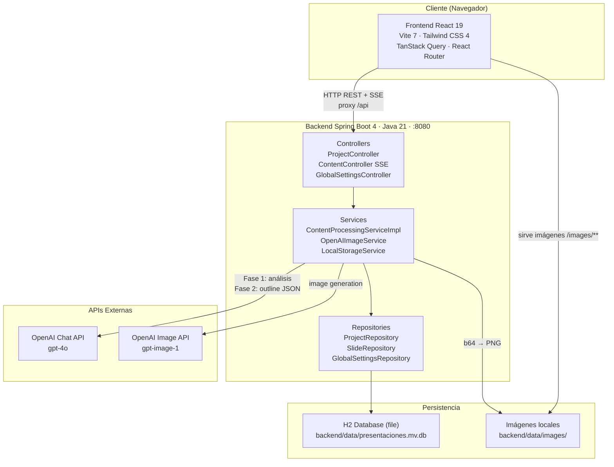
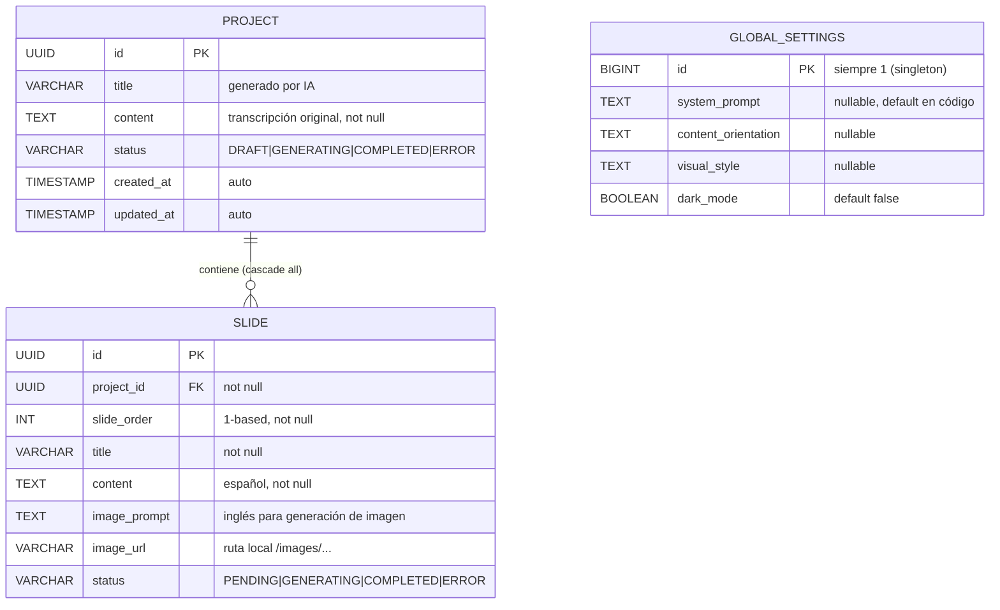

# AyG PresentacionesIA

> Generador automático de presentaciones ejecutivas a partir de transcripciones de reuniones, potenciado por GPT-4o.

---

## Índice

0. [Ficha del proyecto](#0-ficha-del-proyecto)
1. [Descripción general del producto](#1-descripción-general-del-producto)
2. [Arquitectura del sistema](#2-arquitectura-del-sistema)
3. [Modelo de datos](#3-modelo-de-datos)
4. [Especificación de la API](#4-especificación-de-la-api)
5. [Historias de usuario](#5-historias-de-usuario)
6. [Tickets de trabajo](#6-tickets-de-trabajo)
7. [Pull requests](#7-pull-requests)

---

## 0. Ficha del proyecto

### **0.1. Tu nombre completo:**

Alberto Jiménez Díaz

### **0.2. Nombre del proyecto:**

AyG PresentacionesIA

### **0.3. Descripción breve del proyecto:**

AyG PresentacionesIA automatiza la creación de presentaciones ejecutivas profesionales a partir de transcripciones de reuniones. El usuario pega el texto (o sube un archivo `.txt`) y el sistema usa GPT-4o para analizar el contenido, estructurarlo en 10-15 slides con narrativa ejecutiva e ilustrar cada una con imágenes generadas por IA. El resultado es una presentación completa en minutos, sin trabajo manual de diseño ni redacción.

### **0.4. URL del proyecto:**

No disponible — el proyecto se ejecuta en entorno local. Ver instrucciones de instalación en la sección 1.4.

### **0.5. URL o archivo comprimido del repositorio**

- Repositorio de entrega: https://github.com/allenajd3/AI4Devs-finalproject
- Repositorio del código fuente: https://github.com/allenajd3/aygPresentacionesIA

---

## 1. Descripción general del producto

### **1.1. Objetivo:**

AyG PresentacionesIA resuelve un problema de productividad muy concreto en entornos profesionales: transformar notas o grabaciones de reuniones en presentaciones ejecutivas de calidad consume entre 2 y 4 horas de trabajo manual por reunión. El sistema automatiza ese proceso de extremo a extremo.

**Para quién:** Profesionales y directivos que asisten frecuentemente a reuniones y necesitan comunicar sus resultados de forma visual y ejecutiva, sin disponer de tiempo ni de un equipo de diseño dedicado.

**Valor que aporta:**
- El usuario proporciona la transcripción → obtiene una presentación completa en menos de 5 minutos.
- La IA aplica una estructura narrativa no lineal (Introducción / Nudo / Resolución), no el clásico listado de puntos.
- Cada slide incluye contenido redactado en español e imagen generada específicamente para ese contexto visual.
- Los ajustes globales (estilo corporativo, orientación de contenido, prompt del sistema) permiten personalizar el resultado sin tocar el código.

### **1.2. Características y funcionalidades principales:**

| # | Funcionalidad | Descripción | Estado |
|---|---|---|---|
| F-01 | Ingesta de transcripción | Texto pegado directamente o carga de archivo `.txt` | ✅ Implementada |
| F-02 | Análisis IA (Fase 1) | GPT-4o extrae estructura, puntos clave, métricas y temas visuales | ✅ Implementada |
| F-03 | Generación de outline (Fase 2) | GPT-4o crea 10-15 slides con título, contenido (ES) y description (EN) | ✅ Implementada |
| F-04 | Generación de imágenes | Una imagen por slide generada vía OpenAI Image API | ✅ Implementada |
| F-05 | Progreso en tiempo real | Server-Sent Events muestran cada paso de la generación al usuario | ✅ Implementada |
| F-06 | Registro e inicio de sesión | Autenticación con email/contraseña y JWT; proyectos privados por usuario | 📋 Pendiente — Entrega 2 |
| F-07 | Gestión de proyectos | Crear, listar, ver detalle y eliminar presentaciones | ✅ Implementada |
| F-08 | Configuración global | System prompt, orientación de contenido, estilo visual, dark mode | ✅ Implementada |
| F-09 | Modo oscuro/claro | Toggle que persiste en base de datos y se aplica globalmente | ✅ Implementada |
| F-10 | Exportación a PDF | Descarga de la presentación completa | 📋 Pendiente — Entrega 2 |

### **1.3. Diseño y experiencia de usuario:**

La interfaz sigue un flujo lineal de tres pasos desde el sidebar de navegación:

**Flujo principal E2E:**

1. **`/crear`** — El usuario pega la transcripción en un textarea (mínimo 100 caracteres, validado en tiempo real con contador) o carga un archivo `.txt`. Pulsa "Generar Presentación".
2. **Modal de progreso** — Aparece automáticamente al iniciar la generación. Muestra paso a paso el avance del pipeline IA (análisis, generación de outline, creación de imágenes) vía SSE, sin necesidad de recargar.
3. **`/proyectos/:id`** — Al completarse, la app navega automáticamente a la página de detalle. Se muestran todas las slides generadas con su imagen, título y contenido.
4. **`/proyectos`** — Grid de todas las presentaciones con estado (badge), título y fecha.
5. **`/ajustes`** — Personalización del comportamiento de la IA: system prompt, orientación del contenido, estilo visual y toggle de modo oscuro.

> 🔐 Las páginas `/login` y `/register` (autenticación multi-usuario) están diseñadas en el PRD y se incorporarán en la Entrega 2.

> 📸 **Capturas de pantalla:** pendientes de añadir en la entrega final.

### **1.4. Instrucciones de instalación:**

**Requisitos previos:**
- Java 21 o superior (`JAVA_HOME` configurado)
- Maven 3.8+
- Node.js 20+
- Cuenta OpenAI con API key activa

**1. Clonar el repositorio:**
```bash
git clone https://github.com/allenajd3/AI4Devs-finalproject.git
cd AI4Devs-finalproject
```

**2. Configurar la API key de OpenAI:**

Exportar como variable de entorno (recomendado):
```bash
export OPENAI_API_KEY=sk-proj-...
```

**3. Arrancar el backend** (desde la carpeta `backend/`):
```bash
cd backend
export JAVA_HOME='C:/JAVA/openjdk-24'   # Ajustar a tu ruta de Java 21+
mvn spring-boot:run
```

El backend arranca en `http://localhost:8080`. La base de datos H2 se crea automáticamente en `backend/data/presentaciones.mv.db`.

**4. Arrancar el frontend** (desde la carpeta `frontend/`, en otra terminal):
```bash
cd frontend
npm install
npm run dev
```

El frontend arranca en `http://localhost:5173` y proxifica las llamadas a `/api` al backend automáticamente.

**5. Acceder a la aplicación:**

Abrir `http://localhost:5173` en el navegador y comenzar en la página **Crear** pegando una transcripción.

> 💡 Alternativa en Windows: el script [start-dev.cmd](start-dev.cmd) arranca backend y frontend en dos terminales.

**Resetear la base de datos (si es necesario):**
```bash
# Detener el backend primero, luego:
rm -rf backend/data/
```

---

## 2. Arquitectura del Sistema

### **2.1. Diagrama de arquitectura:**



**Patrón arquitectónico:** Layered Architecture (Controller → Service → Repository) en el backend, combinado con Component-Based Architecture en el frontend.

**Justificación:** La separación en capas facilita el testing unitario de servicios de forma aislada (mockeando el repositorio) y el intercambio de implementaciones vía interfaces (p.ej. cambiar el proveedor de imágenes sin tocar el controller). En el frontend, TanStack Query actúa como capa de estado asíncrono, desacoplando la UI de las llamadas HTTP.

**Trade-offs:** H2 file-based simplifica el despliegue local pero deberá migrarse a PostgreSQL para producción. La integración OpenAI mediante `RestTemplate` directo (sin Spring AI) da control total sobre el request pero requiere más código de infraestructura.

### **2.2. Descripción de componentes principales:**

**Frontend**

| Componente | Tecnología | Responsabilidad |
|---|---|---|
| Páginas | React 19 + TypeScript | `CrearPage`, `ProyectosPage`, `ProyectoDetallePage`, `AjustesPage` |
| Layout | Tailwind CSS 4 | Sidebar colapsable, dark mode global, navegación |
| Hooks | TanStack Query 5 | `useProjects`, `useSlides`, `useContentGeneration` (ciclo de vida SSE) |
| Servicios | Axios 1.13 | `api.ts` (REST), `contentApi.ts` (SSE via EventSource) |
| Tema | `ThemeSync` | Sincroniza el dark mode persistido en settings con la clase `dark` del documento |

**Backend**

| Capa | Clases principales | Responsabilidad |
|---|---|---|
| Controller | `ProjectController`, `ContentController`, `GlobalSettingsController` | Endpoints REST y SSE |
| Service | `ContentProcessingServiceImpl`, `OpenAIImageService`, `LocalStorageService`, `GlobalSettingsService` | Lógica de negocio e integración OpenAI |
| Repository | `ProjectRepository`, `SlideRepository`, `GlobalSettingsRepository` | Acceso a datos vía Spring Data JPA |
| Model | `Project`, `Slide`, `GlobalSettings` | Entidades JPA |
| Config | `WebConfig` | Resource handlers para servir imágenes en `/images/**` |

> 🔐 Los componentes de autenticación (`AuthController`, `AuthService`, `SecurityConfig`, entidad `User`, `LoginPage`/`RegisterPage` e interceptor JWT) están diseñados en el PRD y se implementarán en la Entrega 2.

### **2.3. Descripción de alto nivel del proyecto y estructura de ficheros**

```
AI4Devs-finalproject/
├── backend/                        # API REST + pipeline IA (Spring Boot 4)
│   ├── src/main/java/com/ayg/presentaciones/
│   │   ├── config/                 # WebConfig (recursos estáticos /images/**)
│   │   ├── controller/             # ProjectController, ContentController (SSE), GlobalSettingsController
│   │   ├── dto/                    # Objetos de transferencia (request/response) — nunca entidades JPA directas
│   │   ├── model/                  # Entidades JPA: Project, Slide, GlobalSettings + enums
│   │   ├── repository/             # Interfaces Spring Data JPA
│   │   └── service/                # Lógica de negocio: pipeline IA, imágenes, storage, settings
│   ├── src/main/resources/
│   │   └── application.properties  # Config BD, OpenAI API key, storage path
│   └── data/                       # BD H2 (presentaciones.mv.db) e imágenes generadas (gitignored)
│
├── frontend/                       # SPA React 19 + TypeScript
│   └── src/
│       ├── pages/                  # Una página por ruta: Crear, Proyectos, Detalle, Ajustes
│       ├── components/             # Layout, SlideCard, GenerationProgress (modal SSE), ThemeSync, Logo
│       ├── hooks/                  # useProjects, useSlides, useContentGeneration
│       ├── services/               # api.ts (Axios), contentApi.ts (SSE)
│       └── types/                  # Tipos TypeScript: Project, Slide, Settings
│
├── openspec/                       # Specs y changes del flujo spec-driven (OpenSpec)
│   ├── project.md                  # Contexto del proyecto para los agentes IA
│   ├── specs/                      # Specs por capacidad (estado actual del sistema)
│   └── changes/archive/            # Changes completados durante el desarrollo
│
├── docs/                           # Documentación del proyecto
│   └── PRD-AYGPresentaciones.md    # PRD completo con todas las historias y tickets
├── prompts.md                      # Registro de prompts usados durante el desarrollo
└── start-dev.cmd                   # Script para arrancar backend + frontend en Windows
```

**Patrón de organización:** Feature-agnostic layering en backend (todas las capas en un único módulo dado el tamaño del MVP), y organización por tipo de artefacto en frontend (pages/components/hooks/services/types).

### **2.4. Infraestructura y despliegue**

El proyecto se ejecuta actualmente en **entorno local**. El proceso de despliegue previsto para producción es:

```
Backend  →  mvn clean package  →  JAR ejecutable  →  Dockerfile  →  Contenedor Docker
Frontend →  npm run build      →  dist/ estático  →  Nginx       →  Servido como SPA
```

Variables de entorno necesarias en producción:
- `OPENAI_API_KEY` — clave de la API de OpenAI
- `SPRING_DATASOURCE_URL` — conexión a PostgreSQL (sustituye H2)
- `JWT_SECRET` — clave secreta para firmar los tokens JWT (cuando se implemente la autenticación en la Entrega 2)
- `APP_STORAGE_LOCATION` — ruta para almacenar imágenes generadas

> El pipeline CI/CD (GitHub Actions) y el despliegue en un proveedor cloud (Railway, Render o similar) se abordarán en la Entrega 2.

### **2.5. Seguridad**

Prácticas implementadas en el MVP actual:

| Práctica | Implementación |
|---|---|
| **Prevención de SQL Injection** | JPA + consultas parametrizadas — ninguna query construida con concatenación de strings |
| **Validaciones de entrada** | Validación de la transcripción (mínimo 100 caracteres) en frontend y backend |
| **API Key fuera del código** | `OPENAI_API_KEY` se inyecta como variable de entorno; no se commitea en el repositorio |
| **DTOs en la API** | Las entidades JPA nunca se exponen directamente en las respuestas |

Prácticas diseñadas para la Entrega 2 (junto con la autenticación):

| Práctica | Diseño previsto |
|---|---|
| **Contraseñas hasheadas** | bcrypt vía Spring Security — nunca se almacenará la contraseña en texto plano |
| **Autenticación stateless** | JWT firmado con clave secreta; expiración de 24h; enviado en header `Authorization: Bearer` |
| **Autorización por recurso** | `GET /api/projects` filtrará por `user_id` del JWT — un usuario no podrá ver proyectos de otro |
| **Endpoints protegidos** | Filtro JWT interceptará todas las rutas excepto `/api/auth/**`; devolverá 401 sin token válido |
| **CORS controlado** | `WebConfig` definirá los orígenes permitidos explícitamente (no `*` en producción) |

### **2.6. Tests**

Estrategia de testing en tres niveles (implementación prevista para la Entrega 2):

**Backend (JUnit 5 + Mockito + Spring Boot Test):**
- *Unitarios:* `ContentProcessingServiceImpl` — verificar parsing de JSON de OpenAI, propagación de errores a estado `ERROR`, construcción de prompts con `GlobalSettings`.
- *Repositorios (`@DataJpaTest`):* `ProjectRepository` — crear/listar por `userId`, eliminar en cascada sobre slides. Usa H2 en memoria, sin configuración extra.
- *Controllers (`MockMvc`):* `AuthController` — registro con email duplicado devuelve 409; login incorrecto devuelve 401; login correcto devuelve JWT. `ProjectController` — endpoints devuelven 401 sin token.

**Frontend (Vitest + React Testing Library):**
- `CrearPage`: el botón "Generar" se desactiva con menos de 100 caracteres y se activa al superarlos.
- `GenerationProgress`: al recibir eventos SSE mockeados (via MSW), el modal muestra el paso actual y navega al completarse.
- `SlideCard`: renderiza imagen si `imageUrl` existe; muestra placeholder si es `null`.

**E2E (Playwright):**
- Flujo completo: login → crear proyecto con transcripción → modal de progreso → página de detalle con slides generadas.
- Guard de rutas: acceder a `/crear` sin autenticación redirige a `/login`.

---

## 3. Modelo de Datos

### **3.1. Diagrama del modelo de datos:**

Modelo implementado actualmente (la entidad `User` y la relación `user_id` en `Project` se incorporarán con la autenticación en la Entrega 2):



### **3.2. Descripción de entidades principales:**

**Project** — Presentación completa.

| Campo | Tipo | Restricciones | Descripción |
|---|---|---|---|
| `id` | UUID | PK, auto-generado | Identificador único |
| `title` | VARCHAR | — | Título ejecutivo generado por IA |
| `content` | TEXT | NOT NULL | Transcripción original de entrada |
| `status` | ENUM | NOT NULL | `DRAFT` · `GENERATING` · `COMPLETED` · `ERROR` |
| `created_at` | TIMESTAMP | NOT NULL, auto | Fecha/hora de creación |
| `updated_at` | TIMESTAMP | NOT NULL, auto | Fecha/hora de última modificación |

**Slide** — Diapositiva individual dentro de un proyecto.

| Campo | Tipo | Restricciones | Descripción |
|---|---|---|---|
| `id` | UUID | PK, auto-generado | Identificador único |
| `project_id` | UUID | FK → Project, NOT NULL | Proyecto propietario (cascade delete) |
| `slide_order` | INT | NOT NULL | Número de orden (1-based) |
| `title` | VARCHAR | NOT NULL | Título de la diapositiva |
| `content` | TEXT | NOT NULL | Contenido redactado en español |
| `image_prompt` | TEXT | — | Descripción en inglés para generar la imagen |
| `image_url` | VARCHAR | — | Ruta local de la imagen (`/images/...`) |
| `status` | ENUM | NOT NULL | `PENDING` · `GENERATING` · `COMPLETED` · `ERROR` |

**GlobalSettings** — Configuración global del sistema (singleton, siempre `id=1`).

| Campo | Tipo | Restricciones | Descripción |
|---|---|---|---|
| `id` | BIGINT | PK, siempre `1` | Garantiza una única fila |
| `system_prompt` | TEXT | nullable | Instrucciones adicionales para GPT-4o en ambas fases |
| `content_orientation` | TEXT | nullable | Enfoque del contenido (ej: "orientado a resultados") |
| `visual_style` | TEXT | nullable | Descripción del estilo visual para las imágenes |
| `dark_mode` | BOOLEAN | NOT NULL, default `false` | Flag de tema oscuro en la UI |

**User** *(Entrega 2)* — Usuario registrado en el sistema. Añadirá la columna `user_id` (FK) a `Project` para que cada usuario solo vea sus presentaciones.

| Campo | Tipo | Restricciones | Descripción |
|---|---|---|---|
| `id` | UUID | PK, auto-generado | Identificador único |
| `username` | VARCHAR | UNIQUE, NOT NULL | Nombre de usuario elegido en el registro |
| `email` | VARCHAR | UNIQUE, NOT NULL | Email usado para el login |
| `password_hash` | VARCHAR | NOT NULL | Contraseña hasheada con bcrypt (factor 10) |
| `created_at` | TIMESTAMP | NOT NULL, auto | Fecha/hora de registro |
| `updated_at` | TIMESTAMP | NOT NULL, auto | Fecha/hora de última modificación |

---

## 4. Especificación de la API

Los tres endpoints más representativos del flujo E2E, en formato OpenAPI 3.0:

```yaml
openapi: 3.0.3
info:
  title: AyG PresentacionesIA API
  version: 1.0.0
  description: API REST para generación automatizada de presentaciones con IA

servers:
  - url: http://localhost:8080/api

paths:

  /projects:
    post:
      summary: Crear proyecto
      description: Crea un nuevo proyecto con la transcripción proporcionada. El título se auto-genera en la fase de generación.
      tags: [Proyectos]
      requestBody:
        required: true
        content:
          application/json:
            schema:
              type: object
              required: [title, content]
              properties:
                title:
                  type: string
                  example: Reunión Q3 Resultados
                content:
                  type: string
                  minLength: 100
                  description: Transcripción de la reunión (mínimo 100 caracteres)
                  example: "En la reunión del 5 de junio discutimos los resultados del Q3..."
      responses:
        '201':
          description: Proyecto creado
          content:
            application/json:
              schema:
                type: object
                properties:
                  id:
                    type: string
                    format: uuid
                    example: 550e8400-e29b-41d4-a716-446655440000
                  title:
                    type: string
                    example: Reunión Q3 Resultados
                  status:
                    type: string
                    enum: [DRAFT, GENERATING, COMPLETED, ERROR]
                    example: DRAFT
                  createdAt:
                    type: string
                    format: date-time
        '400':
          description: Transcripción inválida (menos de 100 caracteres)

  /projects/{id}/generate-content:
    get:
      summary: Generar contenido con IA (SSE)
      description: |
        Inicia el pipeline de generación de 2 fases (análisis + outline) y emite el progreso
        en tiempo real mediante Server-Sent Events. La conexión permanece abierta hasta que
        el pipeline finaliza o supera el timeout de 10 minutos.

        Eventos emitidos:
        - `progress`: actualización de paso y porcentaje
        - `complete`: finalización correcta con projectId
        - `error`: error en el pipeline con mensaje descriptivo
      tags: [Generación]
      parameters:
        - name: id
          in: path
          required: true
          schema:
            type: string
            format: uuid
          description: ID del proyecto a procesar
      responses:
        '200':
          description: Stream SSE de progreso
          content:
            text/event-stream:
              example: |
                event: progress
                data: {"step":"ANALYZING","message":"Analizando transcripción...","progress":10}

                event: progress
                data: {"step":"GENERATING_OUTLINE","message":"Generando estructura de slides...","progress":35}

                event: progress
                data: {"step":"GENERATING_IMAGES","message":"Generando imagen 3/12...","progress":68}

                event: complete
                data: {"projectId":"550e8400-e29b-41d4-a716-446655440000"}
        '404':
          description: Proyecto no encontrado

  /projects/{id}/slides:
    get:
      summary: Obtener slides de un proyecto
      tags: [Generación]
      parameters:
        - name: id
          in: path
          required: true
          schema:
            type: string
            format: uuid
      responses:
        '200':
          description: Lista de slides ordenadas
          content:
            application/json:
              schema:
                type: array
                items:
                  type: object
                  properties:
                    id: { type: string, format: uuid }
                    order: { type: integer, example: 1 }
                    title: { type: string, example: "Resultados Q3: Superando Expectativas" }
                    content: { type: string }
                    imagePrompt: { type: string }
                    imageUrl: { type: string, example: /images/project-550e8400-slide-1.png }
                    status: { type: string, enum: [PENDING, GENERATING, COMPLETED, ERROR] }
        '404':
          description: Proyecto no encontrado
```

> 🔐 Los endpoints de autenticación (`/auth/register`, `/auth/login`) y la protección con `bearerAuth` (JWT) están especificados en el [PRD](docs/PRD-AYGPresentaciones.md) y se añadirán en la Entrega 2.

---

## 5. Historias de Usuario

**Historia de Usuario 1 — Registro e inicio de sesión** *(planificada — Entrega 2)*

> Como profesional que quiere usar la herramienta, quiero poder registrarme con mi email y contraseña e iniciar sesión, para que mis presentaciones sean privadas y accesibles solo para mí.

**Criterios de aceptación:**
- El usuario puede registrarse con username, email y contraseña (mínimo 8 caracteres).
- Si el email ya existe, se muestra un mensaje de error sin revelar detalles de seguridad.
- El login correcto devuelve un JWT que se almacena en el cliente y se adjunta automáticamente a todas las peticiones posteriores.
- Si el token caduca o no existe, cualquier ruta protegida redirige automáticamente a `/login`.
- Al cerrar sesión, el token se elimina del cliente y el usuario es redirigido al login.

---

**Historia de Usuario 2 — Ingesta de transcripción**

> Como profesional que acaba de salir de una reunión, quiero pegar la transcripción o subir un archivo `.txt` para iniciar la generación de una presentación, de modo que no tenga que introducir el contenido manualmente.

**Criterios de aceptación:**
- El usuario puede pegar texto directamente en el textarea con un contador de caracteres visible en tiempo real.
- El usuario puede cargar un archivo `.txt` y su contenido se vuelca automáticamente en el textarea.
- Si el contenido tiene menos de 100 caracteres, el botón "Generar Presentación" está desactivado y se muestra un mensaje de validación.
- Al pulsar "Generar", se crea el proyecto vía API y se abre inmediatamente el modal de progreso.

---

**Historia de Usuario 3 — Generación automática de slides con IA**

> Como usuario, quiero que el sistema genere automáticamente entre 10 y 15 slides estructuradas a partir de mi transcripción, con título ejecutivo, contenido redactado e imagen por slide, para no tener que crearlas manualmente.

**Criterios de aceptación:**
- El sistema genera un título ejecutivo para la presentación completa.
- Se producen entre 10 y 15 slides con estructura narrativa no lineal (Introducción / Desarrollo / Resolución).
- Cada slide incluye: número de orden, título, contenido en español y descripción en inglés para la imagen.
- Se genera una imagen específica por slide usando la API de imágenes de OpenAI.
- Si falla la generación de una imagen individual, el proyecto continúa y la slide queda en estado `ERROR` sin bloquear al resto.
- El usuario ve el progreso en tiempo real durante todo el proceso.

---

## 6. Tickets de Trabajo

**Ticket 1 — Backend: SSE endpoint de generación de contenido**

- **ID:** TK-007
- **Tipo:** Backend
- **Historia relacionada:** US-003 (progreso en tiempo real), US-002 (generación con IA)
- **Descripción:** Implementar `ContentController.generateContent()` como endpoint SSE. El método crea un `SseEmitter` con timeout de 10 minutos y delega el procesamiento a `ContentProcessingServiceImpl` en un thread de background (ExecutorService), evitando bloquear el thread HTTP. Durante la ejecución, el servicio envía eventos de progreso al emitter. Al finalizar (o si ocurre un error), envía el evento `complete` o `error` correspondiente y cierra el emitter.
- **Criterios de aceptación:**
  - El endpoint devuelve `Content-Type: text/event-stream` con CORS configurado.
  - Se emiten eventos `progress` en cada fase del pipeline (análisis, outline, por cada imagen).
  - Al finalizar correctamente, se emite `event: complete` con `{"projectId": "..."}` y el `Project.status` se actualiza a `COMPLETED`.
  - Si ocurre una excepción, se emite `event: error` con un mensaje descriptivo y `Project.status` se actualiza a `ERROR`.
  - El endpoint devuelve `404` si el proyecto no existe.
  - *(Entrega 2)* El endpoint devolverá `401` si el JWT es inválido o ausente.

---

**Ticket 2 — Frontend: CrearPage — Formulario de ingesta con validación**

- **ID:** TK-004
- **Tipo:** Frontend
- **Historia relacionada:** US-001 (ingesta de transcripción)
- **Descripción:** Implementar la página `/crear` con un textarea para pegar transcripciones, un botón de carga de archivo `.txt` y el botón "Generar Presentación". La validación es en tiempo real: se muestra un contador de caracteres y el botón de generación se desactiva si el contenido no supera los 100 caracteres. Al confirmar, se llama a `POST /api/projects` y, en caso de éxito, se abre el modal `GenerationProgress` que inicia la suscripción SSE.
- **Criterios de aceptación:**
  - El contador muestra `N / 100 caracteres` y cambia de color (rojo/verde) según el umbral.
  - Al seleccionar un archivo `.txt`, su contenido se vuelca en el textarea y el contador se actualiza.
  - El botón "Generar" tiene el atributo `disabled` mientras el contador no supere 100.
  - Al pulsar "Generar": se llama a `POST /api/projects`, se muestra un spinner de carga durante la petición, y al recibir la respuesta se abre el modal de progreso.
  - Si la API devuelve error, se muestra un mensaje descriptivo sin redirigir.

---

**Ticket 3 — Base de datos: Setup entidades JPA y modelo de datos**

- **ID:** TK-001
- **Tipo:** Base de datos
- **Historia relacionada:** US-001, US-002, US-004
- **Descripción:** Definir las entidades JPA del sistema: `Project`, `Slide` y `GlobalSettings`. Configurar H2 file-based con `ddl-auto=update` para desarrollo. La relación `Project → Slide` es one-to-many con `CascadeType.ALL` y `orphanRemoval=true`. `GlobalSettings` implementa el patrón singleton (siempre `id=1`). Todos los IDs son UUIDs auto-generados excepto `GlobalSettings.id` que es `BIGINT`. La entidad `User` y su relación con `Project` se añadirán con la autenticación (Entrega 2).
- **Criterios de aceptación:**
  - El backend arranca y la base de datos se crea automáticamente en `backend/data/presentaciones.mv.db`.
  - La consola H2 es accesible en `http://localhost:8080/h2-console` (solo en perfil de desarrollo).
  - `DELETE` sobre un `Project` elimina en cascada todos sus `Slide` asociados.
  - `GlobalSettings` siempre tiene exactamente una fila con `id=1`; el servicio crea la fila con valores por defecto si no existe.

---

## 7. Pull Requests

El desarrollo se ha realizado de forma incremental en la rama `feature-entrega2-AJD`, siguiendo el flujo spec-driven de OpenSpec: cada funcionalidad tiene su change (proposal → design → tasks → apply → archive) y su commit correspondiente. Los changes completados pueden consultarse en [openspec/changes/archive/](openspec/changes/archive/).

**Pull Request 1 — Creación de base del proyecto y UI inicial**

- **Rama:** `feature-entrega2-AJD`
- **Descripción:** Setup completo del monorepo. Backend: inicialización de Spring Boot 4 con Java 21, configuración de H2 file-based, entidades JPA (`Project`, `Slide`), repositorios y CRUD REST de proyectos con DTOs. Frontend: setup de React 19 + TypeScript + Vite 7 + Tailwind CSS 4 + React Router + TanStack Query, proxy Vite a `/api`, Layout con sidebar y páginas base (Crear, Proyectos, Detalle, Ajustes).
- **Changes OpenSpec:** `define-mvp-specs`, `config-base-backend`, `implement-project-mgmt`, `frontend-mvp-ui`
- **Tickets cubiertos:** TK-001, TK-002, TK-003, TK-004
- **URL:** *(se añadirá al abrir el PR hacia `main`)*

---

**Pull Request 2 — Integración con OpenAI para análisis y generación de contenido**

- **Rama:** `feature-entrega2-AJD`
- **Descripción:** Implementación del pipeline de generación de 2 fases en `ContentProcessingServiceImpl`: Fase 1 (análisis de transcripción con GPT-4o) y Fase 2 (generación de outline JSON con 10-15 slides). Parsing robusto del JSON de respuesta (manejo de markdown code blocks) con records `SlideData`/`SlideOutline`. SSE endpoint en `ContentController` con `SseEmitter` y `ExecutorService`. Modal `GenerationProgress` en el frontend con hook `useContentGeneration` para la suscripción SSE. Persistencia H2 en fichero.
- **Changes OpenSpec:** `implement-content-processing`, `integrate-frontend-content-processing`, `db-h2-file`, `refactor-content-generation`
- **Tickets cubiertos:** TK-005, TK-006, TK-007, TK-008
- **URL:** *(se añadirá al abrir el PR hacia `main`)*

---

**Pull Request 3 — Generación de imágenes, configuración y UX**

- **Rama:** `feature-entrega2-AJD`
- **Descripción:** Integración de la API de generación de imágenes de OpenAI (`gpt-image-1`): `OpenAIImageService` (llamada REST, decodificación de base64) y `LocalStorageService` (guardado de PNG en `backend/data/images/`), servidas como recursos estáticos vía `WebConfig`. Página de Ajustes conectada a la configuración global, identidad visual AyG, modo oscuro persistido y sidebar colapsable.
- **Changes OpenSpec:** `implement-image-generation`, `image-generation-prompt-mods`, `config-page`, `ui-ayg`, `dark-mode`, `collapsible-sidebar`
- **Tickets cubiertos:** TK-009, TK-010, TK-011, TK-012, TK-013
- **URL:** *(se añadirá al abrir el PR hacia `main`)*
