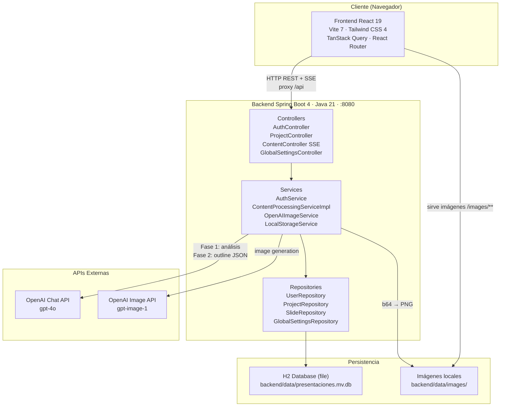
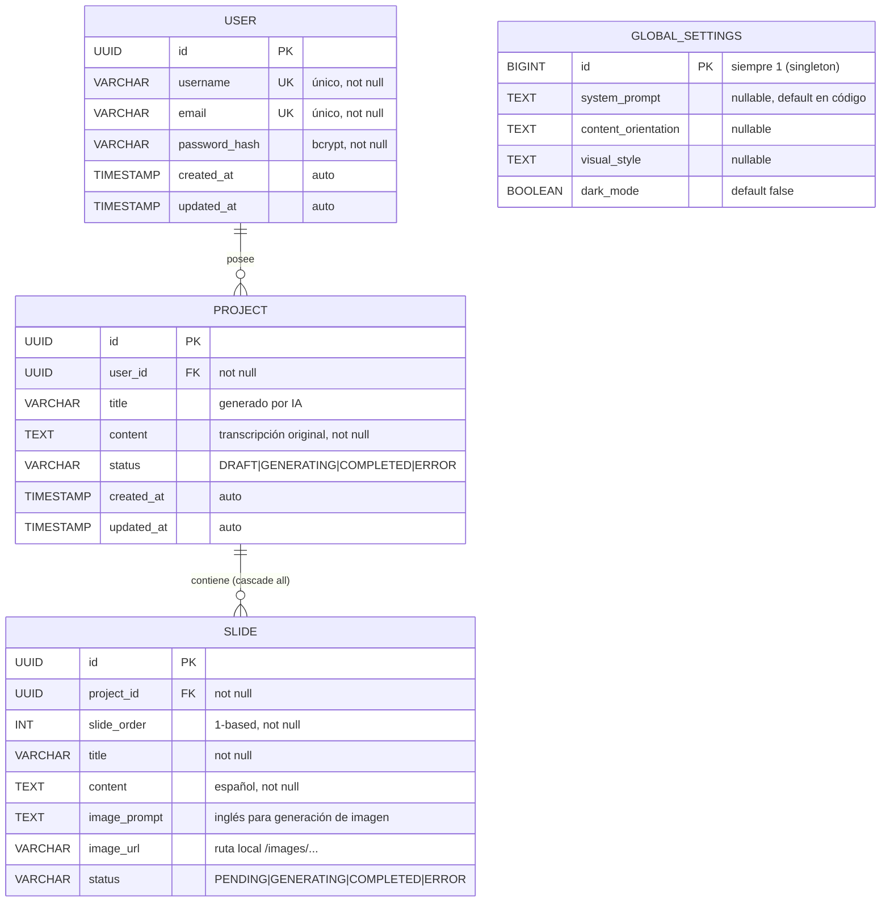

# AyG PresentacionesIA

> Generador automático de presentaciones ejecutivas a partir de transcripciones de reuniones, potenciado por GPT-4o.

---

## Índice

0. [Ficha del proyecto](#0-ficha-del-proyecto)
1. [Descripción general del producto](#1-descripción-general-del-producto)
2. [Arquitectura del sistema](#2-arquitectura-del-sistema)
3. [Modelo de datos](#3-modelo-de-datos)
4. [Especificación de la API](#4-especificación-de-la-api)
5. [Historias de usuario](#5-historias-de-usuario)
6. [Tickets de trabajo](#6-tickets-de-trabajo)
7. [Pull requests](#7-pull-requests)

---

## 0. Ficha del proyecto

### **0.1. Tu nombre completo:**

Alberto Jiménez Díaz

### **0.2. Nombre del proyecto:**

AyG PresentacionesIA

### **0.3. Descripción breve del proyecto:**

AyG PresentacionesIA automatiza la creación de presentaciones ejecutivas profesionales a partir de transcripciones de reuniones. El usuario pega el texto (o sube un archivo `.txt`) y el sistema usa GPT-4o para analizar el contenido, estructurarlo en 10-15 slides con narrativa ejecutiva e ilustrar cada una con imágenes generadas por IA. El resultado es una presentación completa en minutos, sin trabajo manual de diseño ni redacción.

### **0.4. URL del proyecto:**

No disponible en esta entrega — se proporcionará en la Entrega 2 junto con el despliegue del entorno.

### **0.5. URL o archivo comprimido del repositorio**

- Repositorio de entrega: https://github.com/allenajd3/AI4Devs-finalproject

---

## 1. Descripción general del producto

### **1.1. Objetivo:**

AyG PresentacionesIA resuelve un problema de productividad muy concreto en entornos profesionales: transformar notas o grabaciones de reuniones en presentaciones ejecutivas de calidad consume entre 2 y 4 horas de trabajo manual por reunión. El sistema automatiza ese proceso de extremo a extremo.

**Para quién:** Profesionales y directivos que asisten frecuentemente a reuniones y necesitan comunicar sus resultados de forma visual y ejecutiva, sin disponer de tiempo ni de un equipo de diseño dedicado.

**Valor que aporta:**
- El usuario proporciona la transcripción → obtiene una presentación completa en menos de 5 minutos.
- La IA aplica una estructura narrativa no lineal (Introducción / Nudo / Resolución), no el clásico listado de puntos.
- Cada slide incluye contenido redactado en español e imagen generada específicamente para ese contexto visual.
- Los ajustes globales (estilo corporativo, orientación de contenido, prompt del sistema) permiten personalizar el resultado sin tocar el código.

### **1.2. Características y funcionalidades principales:**

| # | Funcionalidad | Descripción | Estado |
|---|---|---|---|
| F-01 | Ingesta de transcripción | Texto pegado directamente o carga de archivo `.txt` | 📋 Pendiente |
| F-02 | Análisis IA (Fase 1) | GPT-4o extrae estructura, puntos clave, métricas y temas visuales | 📋 Pendiente |
| F-03 | Generación de outline (Fase 2) | GPT-4o crea 10-15 slides con título, contenido (ES) y description (EN) | 📋 Pendiente |
| F-04 | Generación de imágenes | Una imagen por slide generada vía OpenAI Image API | 📋 Pendiente |
| F-05 | Progreso en tiempo real | Server-Sent Events muestran cada paso de la generación al usuario | 📋 Pendiente |
| F-06 | Registro e inicio de sesión | Autenticación con email/contraseña y JWT; proyectos privados por usuario | 📋 Pendiente |
| F-07 | Gestión de proyectos | Crear, listar, ver detalle y eliminar presentaciones | 📋 Pendiente |
| F-08 | Configuración global | System prompt, orientación de contenido, estilo visual, dark mode | 📋 Pendiente |
| F-09 | Modo oscuro/claro | Toggle que persiste en base de datos y se aplica globalmente | 📋 Pendiente |
| F-10 | Exportación a PDF | Descarga de la presentación completa | 📋 Pendiente |

### **1.3. Diseño y experiencia de usuario:**

> *(Se completará en la Entrega 2 con capturas de pantalla y/o videotutorial mostrando el flujo principal de la aplicación una vez implementada.)*

### **1.4. Instrucciones de instalación:**

> *(Se completará en la Entrega 2 una vez el código esté operativo, incluyendo los comandos de instalación, configuración de variables de entorno y pasos para arrancar el proyecto en local.)*

---

## 2. Arquitectura del Sistema

### **2.1. Diagrama de arquitectura:**



**Patrón arquitectónico:** Layered Architecture (Controller → Service → Repository) en el backend, combinado con Component-Based Architecture en el frontend.

**Justificación:** La separación en capas facilita el testing unitario de servicios de forma aislada (mockeando el repositorio) y el intercambio de implementaciones vía interfaces (p.ej. cambiar el proveedor de imágenes sin tocar el controller). En el frontend, TanStack Query actúa como capa de estado asíncrono, desacoplando la UI de las llamadas HTTP.

**Trade-offs:** H2 file-based simplifica el despliegue local pero deberá migrarse a PostgreSQL para producción. La integración OpenAI mediante `RestTemplate` directo (sin Spring AI) da control total sobre el request pero requiere más código de infraestructura.

### **2.2. Descripción de componentes principales:**

**Frontend**

| Componente | Tecnología | Responsabilidad |
|---|---|---|
| Páginas | React 19 + TypeScript | `LoginPage`, `RegisterPage`, `CrearPage`, `ProyectosPage`, `ProyectoDetallePage`, `AjustesPage` |
| Layout | Tailwind CSS 4 | Sidebar colapsable, dark mode global, navegación protegida |
| Hooks | TanStack Query 5 | `useProjects`, `useSlides`, `useContentGeneration` (ciclo de vida SSE) |
| Servicios | Axios 1.13 | `api.ts` (REST + JWT interceptor), `contentApi.ts` (SSE via EventSource) |
| Router guard | React Router v7 | Redirige a `/login` si no hay JWT válido en localStorage |

**Backend**

| Capa | Clases principales | Responsabilidad |
|---|---|---|
| Controller | `AuthController`, `ProjectController`, `ContentController`, `GlobalSettingsController` | Endpoints REST y SSE |
| Service | `AuthService`, `ContentProcessingServiceImpl`, `OpenAIImageService`, `LocalStorageService`, `GlobalSettingsService` | Lógica de negocio e integración OpenAI |
| Repository | `UserRepository`, `ProjectRepository`, `SlideRepository`, `GlobalSettingsRepository` | Acceso a datos vía Spring Data JPA |
| Model | `User`, `Project`, `Slide`, `GlobalSettings` | Entidades JPA |
| Config | `WebConfig`, `SecurityConfig` | Resource handlers para imágenes, filtro JWT |

### **2.3. Descripción de alto nivel del proyecto y estructura de ficheros**

```
aygPresentacionesIA/
├── backend/                        # API REST + pipeline IA (Spring Boot 4)
│   ├── src/main/java/com/ayg/presentaciones/
│   │   ├── config/                 # WebConfig (recursos estáticos), SecurityConfig (JWT filter)
│   │   ├── controller/             # AuthController, ProjectController, ContentController, GlobalSettingsController
│   │   ├── dto/                    # Objetos de transferencia (request/response) — nunca entidades JPA directas
│   │   ├── model/                  # Entidades JPA: User, Project, Slide, GlobalSettings + enums
│   │   ├── repository/             # Interfaces Spring Data JPA
│   │   └── service/                # Lógica de negocio: pipeline IA, auth, storage, settings
│   ├── src/main/resources/
│   │   └── application.properties  # Config BD, OpenAI API key, storage path
│   └── data/                       # BD H2 (presentaciones.mv.db) e imágenes generadas (gitignored)
│
├── frontend/                       # SPA React 19 + TypeScript
│   └── src/
│       ├── pages/                  # Una página por ruta: Login, Register, Crear, Proyectos, Detalle, Ajustes
│       ├── components/             # Layout, SlideCard, GenerationProgress (modal SSE), ThemeSync
│       ├── hooks/                  # useProjects, useSlides, useContentGeneration, useAuth
│       ├── services/               # api.ts (Axios + JWT interceptor), contentApi.ts (SSE)
│       └── types/                  # Tipos TypeScript: Project, Slide, User, Settings
│
└── docs/                           # Documentación del proyecto
    ├── PRD-AYGPresentaciones.md    # PRD completo con todas las historias y tickets
    └── prompts.md                  # Registro de prompts usados durante el desarrollo
```

**Patrón de organización:** Feature-agnostic layering en backend (todas las capas en un único módulo dado el tamaño del MVP), y organización por tipo de artefacto en frontend (pages/components/hooks/services/types).

### **2.4. Infraestructura y despliegue**

> *(Se completará en la Entrega 2 con el diagrama de infraestructura, pipeline CI/CD y la URL del entorno desplegado.)*

### **2.5. Seguridad**

Prácticas de seguridad planificadas para la implementación:

| Práctica | Diseño previsto |
|---|---|
| **Contraseñas hasheadas** | bcrypt vía Spring Security — la contraseña nunca se almacenará en texto plano |
| **Autenticación stateless** | JWT firmado con clave secreta; expiración de 24h; transmitido en header `Authorization: Bearer` |
| **Autorización por recurso** | `GET /api/projects` filtrará por `user_id` extraído del JWT — un usuario no podrá acceder a proyectos ajenos |
| **Endpoints protegidos** | Filtro JWT interceptará todas las rutas excepto `/api/auth/**`; devolverá 401 sin token válido |
| **Prevención de SQL Injection** | JPA con consultas parametrizadas — sin concatenación de strings en queries |
| **Validaciones de entrada** | Jakarta Validation (`@NotBlank`, `@Email`, `@Size`) en todos los DTOs de request |
| **API Key fuera del código** | `OPENAI_API_KEY` se inyectará como variable de entorno; no se commiteará en el repositorio |
| **CORS controlado** | `WebConfig` definirá los orígenes permitidos explícitamente (no `*` en producción) |

### **2.6. Tests**

Estrategia de testing planificada en tres niveles:

**Backend — JUnit 5 + Mockito + Spring Boot Test:**
- *Tests unitarios:* `ContentProcessingServiceImpl` — parsing de JSON de OpenAI, propagación de errores, construcción de prompts con `GlobalSettings`.
- *Tests de repositorio (`@DataJpaTest`):* `ProjectRepository` — listado por `userId`, eliminación en cascada sobre slides. Usará H2 en memoria, sin configuración adicional.
- *Tests de controller (`MockMvc`):* `AuthController` — registro con email duplicado, login incorrecto (401), login correcto (JWT). `ProjectController` — protección de endpoints sin token.

**Frontend — Vitest + React Testing Library:**
- `CrearPage`: validación del umbral de 100 caracteres en el botón "Generar".
- `GenerationProgress`: respuesta a eventos SSE mockeados y navegación al completarse.
- `SlideCard`: renderizado con imagen vs. placeholder.

**E2E — Playwright:**
- Flujo completo: login → crear proyecto → modal de progreso → página de detalle con slides.
- Guard de rutas: acceso a `/crear` sin autenticación redirige a `/login`.

---

## 3. Modelo de Datos

### **3.1. Diagrama del modelo de datos:**



### **3.2. Descripción de entidades principales:**

**User** — Usuario registrado en el sistema.

| Campo | Tipo | Restricciones | Descripción |
|---|---|---|---|
| `id` | UUID | PK, auto-generado | Identificador único |
| `username` | VARCHAR | UNIQUE, NOT NULL | Nombre de usuario elegido en el registro |
| `email` | VARCHAR | UNIQUE, NOT NULL | Email usado para el login |
| `password_hash` | VARCHAR | NOT NULL | Contraseña hasheada con bcrypt (factor 10) |
| `created_at` | TIMESTAMP | NOT NULL, auto | Fecha/hora de registro |
| `updated_at` | TIMESTAMP | NOT NULL, auto | Fecha/hora de última modificación |

**Project** — Presentación completa, siempre asociada a un usuario.

| Campo | Tipo | Restricciones | Descripción |
|---|---|---|---|
| `id` | UUID | PK, auto-generado | Identificador único |
| `user_id` | UUID | FK → User, NOT NULL | Usuario propietario |
| `title` | VARCHAR | — | Título ejecutivo generado por IA |
| `content` | TEXT | NOT NULL | Transcripción original de entrada |
| `status` | ENUM | NOT NULL | `DRAFT` · `GENERATING` · `COMPLETED` · `ERROR` |
| `created_at` | TIMESTAMP | NOT NULL, auto | Fecha/hora de creación |
| `updated_at` | TIMESTAMP | NOT NULL, auto | Fecha/hora de última modificación |

**Slide** — Diapositiva individual dentro de un proyecto.

| Campo | Tipo | Restricciones | Descripción |
|---|---|---|---|
| `id` | UUID | PK, auto-generado | Identificador único |
| `project_id` | UUID | FK → Project, NOT NULL | Proyecto propietario (cascade delete) |
| `slide_order` | INT | NOT NULL | Número de orden (1-based) |
| `title` | VARCHAR | NOT NULL | Título de la diapositiva |
| `content` | TEXT | NOT NULL | Contenido redactado en español |
| `image_prompt` | TEXT | — | Descripción en inglés para generar la imagen |
| `image_url` | VARCHAR | — | Ruta local de la imagen (`/images/...`) |
| `status` | ENUM | NOT NULL | `PENDING` · `GENERATING` · `COMPLETED` · `ERROR` |

**GlobalSettings** — Configuración global del sistema (singleton, siempre `id=1`).

| Campo | Tipo | Restricciones | Descripción |
|---|---|---|---|
| `id` | BIGINT | PK, siempre `1` | Garantiza una única fila |
| `system_prompt` | TEXT | nullable | Instrucciones adicionales para GPT-4o en ambas fases |
| `content_orientation` | TEXT | nullable | Enfoque del contenido (ej: "orientado a resultados") |
| `visual_style` | TEXT | nullable | Descripción del estilo visual para las imágenes |
| `dark_mode` | BOOLEAN | NOT NULL, default `false` | Flag de tema oscuro en la UI |

---

## 4. Especificación de la API

Los tres endpoints más representativos del flujo E2E, en formato OpenAPI 3.0:

```yaml
openapi: 3.0.3
info:
  title: AyG PresentacionesIA API
  version: 1.0.0
  description: API REST para generación automatizada de presentaciones con IA

servers:
  - url: http://localhost:8080/api

paths:

  /auth/login:
    post:
      summary: Iniciar sesión
      description: Autentica al usuario con email y contraseña. Devuelve un JWT para usar en el resto de endpoints.
      tags: [Autenticación]
      requestBody:
        required: true
        content:
          application/json:
            schema:
              type: object
              required: [email, password]
              properties:
                email:
                  type: string
                  format: email
                  example: alberto@empresa.com
                password:
                  type: string
                  minLength: 8
                  example: MiPassword123!
      responses:
        '200':
          description: Login correcto — devuelve JWT
          content:
            application/json:
              schema:
                type: object
                properties:
                  token:
                    type: string
                    example: eyJhbGciOiJIUzI1NiIsInR5cCI6IkpXVCJ9...
                  expiresIn:
                    type: integer
                    example: 86400
        '401':
          description: Credenciales incorrectas

  /projects:
    post:
      summary: Crear proyecto
      description: Crea un nuevo proyecto con la transcripción proporcionada. El título se auto-genera en la fase de generación.
      tags: [Proyectos]
      security:
        - bearerAuth: []
      requestBody:
        required: true
        content:
          application/json:
            schema:
              type: object
              required: [title, content]
              properties:
                title:
                  type: string
                  example: Reunión Q3 Resultados
                content:
                  type: string
                  minLength: 100
                  description: Transcripción de la reunión (mínimo 100 caracteres)
                  example: "En la reunión del 5 de junio discutimos los resultados del Q3..."
      responses:
        '201':
          description: Proyecto creado
          content:
            application/json:
              schema:
                type: object
                properties:
                  id:
                    type: string
                    format: uuid
                    example: 550e8400-e29b-41d4-a716-446655440000
                  title:
                    type: string
                    example: Reunión Q3 Resultados
                  status:
                    type: string
                    enum: [DRAFT, GENERATING, COMPLETED, ERROR]
                    example: DRAFT
                  createdAt:
                    type: string
                    format: date-time
        '401':
          description: No autenticado

  /projects/{id}/generate-content:
    get:
      summary: Generar contenido con IA (SSE)
      description: |
        Inicia el pipeline de generación de 2 fases (análisis + outline) y emite el progreso
        en tiempo real mediante Server-Sent Events. La conexión permanece abierta hasta que
        el pipeline finaliza o supera el timeout de 10 minutos.

        Eventos emitidos:
        - `progress`: actualización de paso y porcentaje
        - `complete`: finalización correcta con projectId
        - `error`: error en el pipeline con mensaje descriptivo
      tags: [Generación]
      security:
        - bearerAuth: []
      parameters:
        - name: id
          in: path
          required: true
          schema:
            type: string
            format: uuid
          description: ID del proyecto a procesar
      responses:
        '200':
          description: Stream SSE de progreso
          content:
            text/event-stream:
              example: |
                event: progress
                data: {"step":"ANALYZING","message":"Analizando transcripción...","progress":10}

                event: progress
                data: {"step":"GENERATING_OUTLINE","message":"Generando estructura de slides...","progress":35}

                event: progress
                data: {"step":"GENERATING_IMAGES","message":"Generando imagen 3/12...","progress":68}

                event: complete
                data: {"projectId":"550e8400-e29b-41d4-a716-446655440000"}
        '401':
          description: No autenticado
        '404':
          description: Proyecto no encontrado o no pertenece al usuario

components:
  securitySchemes:
    bearerAuth:
      type: http
      scheme: bearer
      bearerFormat: JWT
```

---

## 5. Historias de Usuario

**Historia de Usuario 1 — Registro e inicio de sesión**

> Como profesional que quiere usar la herramienta, quiero poder registrarme con mi email y contraseña e iniciar sesión, para que mis presentaciones sean privadas y accesibles solo para mí.

**Criterios de aceptación:**
- El usuario puede registrarse con username, email y contraseña (mínimo 8 caracteres).
- Si el email ya existe, se muestra un mensaje de error sin revelar detalles de seguridad.
- El login correcto devuelve un JWT que se almacena en el cliente y se adjunta automáticamente a todas las peticiones posteriores.
- Si el token caduca o no existe, cualquier ruta protegida redirige automáticamente a `/login`.
- Al cerrar sesión, el token se elimina del cliente y el usuario es redirigido al login.

---

**Historia de Usuario 2 — Ingesta de transcripción**

> Como profesional que acaba de salir de una reunión, quiero pegar la transcripción o subir un archivo `.txt` para iniciar la generación de una presentación, de modo que no tenga que introducir el contenido manualmente.

**Criterios de aceptación:**
- El usuario puede pegar texto directamente en el textarea con un contador de caracteres visible en tiempo real.
- El usuario puede cargar un archivo `.txt` y su contenido se vuelca automáticamente en el textarea.
- Si el contenido tiene menos de 100 caracteres, el botón "Generar Presentación" está desactivado y se muestra un mensaje de validación.
- Al pulsar "Generar", se crea el proyecto vía API y se abre inmediatamente el modal de progreso.

---

**Historia de Usuario 3 — Generación automática de slides con IA**

> Como usuario, quiero que el sistema genere automáticamente entre 10 y 15 slides estructuradas a partir de mi transcripción, con título ejecutivo, contenido redactado e imagen por slide, para no tener que crearlas manualmente.

**Criterios de aceptación:**
- El sistema genera un título ejecutivo para la presentación completa.
- Se producen entre 10 y 15 slides con estructura narrativa no lineal (Introducción / Desarrollo / Resolución).
- Cada slide incluye: número de orden, título, contenido en español y descripción en inglés para la imagen.
- Se genera una imagen específica por slide usando la API de imágenes de OpenAI.
- Si falla la generación de una imagen individual, el proyecto continúa y la slide queda en estado `ERROR` sin bloquear al resto.
- El usuario ve el progreso en tiempo real durante todo el proceso.

---

## 6. Tickets de Trabajo

**Ticket 1 — Backend: SSE endpoint de generación de contenido**

- **ID:** TK-007
- **Tipo:** Backend
- **Historia relacionada:** US-003 (progreso en tiempo real), US-002 (generación con IA)
- **Descripción:** Implementar `ContentController.generateContent()` como endpoint SSE. El método crea un `SseEmitter` con timeout de 10 minutos y delega el procesamiento a `ContentProcessingServiceImpl` en un thread de background (ExecutorService), evitando bloquear el thread HTTP. Durante la ejecución, el servicio envía eventos de progreso al emitter. Al finalizar (o si ocurre un error), envía el evento `complete` o `error` correspondiente y cierra el emitter.
- **Criterios de aceptación:**
  - El endpoint devuelve `Content-Type: text/event-stream` con CORS configurado.
  - Se emiten eventos `progress` en cada fase del pipeline (análisis, outline, por cada imagen).
  - Al finalizar correctamente, se emite `event: complete` con `{"projectId": "..."}` y el `Project.status` se actualiza a `COMPLETED`.
  - Si ocurre una excepción, se emite `event: error` con un mensaje descriptivo y `Project.status` se actualiza a `ERROR`.
  - El endpoint devuelve `401` si el JWT es inválido o ausente.
  - El endpoint devuelve `404` si el proyecto no existe o no pertenece al usuario autenticado.

---

**Ticket 2 — Frontend: CrearPage — Formulario de ingesta con validación**

- **ID:** TK-004
- **Tipo:** Frontend
- **Historia relacionada:** US-001 (ingesta de transcripción)
- **Descripción:** Implementar la página `/crear` con un textarea para pegar transcripciones, un botón de carga de archivo `.txt` y el botón "Generar Presentación". La validación es en tiempo real: se muestra un contador de caracteres y el botón de generación se desactiva si el contenido no supera los 100 caracteres. Al confirmar, se llama a `POST /api/projects` y, en caso de éxito, se abre el modal `GenerationProgress` que inicia la suscripción SSE.
- **Criterios de aceptación:**
  - El contador muestra `N / 100 caracteres` y cambia de color (rojo/verde) según el umbral.
  - Al seleccionar un archivo `.txt`, su contenido se vuelca en el textarea y el contador se actualiza.
  - El botón "Generar" tiene el atributo `disabled` mientras el contador no supere 100.
  - Al pulsar "Generar": se llama a `POST /api/projects`, se muestra un spinner de carga durante la petición, y al recibir la respuesta se abre el modal de progreso.
  - Si la API devuelve error, se muestra un mensaje descriptivo sin redirigir.

---

**Ticket 3 — Base de datos: Setup entidades JPA y modelo de datos**

- **ID:** TK-001
- **Tipo:** Base de datos
- **Historia relacionada:** US-001, US-002, US-004, US-000
- **Descripción:** Definir las entidades JPA del sistema: `User`, `Project`, `Slide` y `GlobalSettings`. Configurar H2 file-based con `ddl-auto=update` para desarrollo. La relación `User → Project` es one-to-many; la relación `Project → Slide` es one-to-many con `CascadeType.ALL` y `orphanRemoval=true`. `GlobalSettings` implementa el patrón singleton (siempre `id=1`). Todos los IDs son UUIDs auto-generados excepto `GlobalSettings.id` que es `BIGINT`.
- **Criterios de aceptación:**
  - El backend arranca y la base de datos se crea automáticamente en `backend/data/presentaciones.mv.db`.
  - La consola H2 es accesible en `http://localhost:8080/h2-console` (solo en perfil de desarrollo).
  - `DELETE` sobre un `Project` elimina en cascada todos sus `Slide` asociados.
  - `DELETE` sobre un `User` elimina en cascada todos sus `Project` (y por tanto sus `Slide`).
  - `GlobalSettings` siempre tiene exactamente una fila con `id=1`; el servicio crea la fila con valores por defecto si no existe.
  - Los campos marcados como `UNIQUE` (username, email) lanzan excepción de integridad si se intenta duplicar.

---

## 7. Pull Requests

> *(Se documentarán en la Entrega 2 una vez realizados los PRs de implementación, incluyendo título, descripción, rama y URL de cada uno.)*
